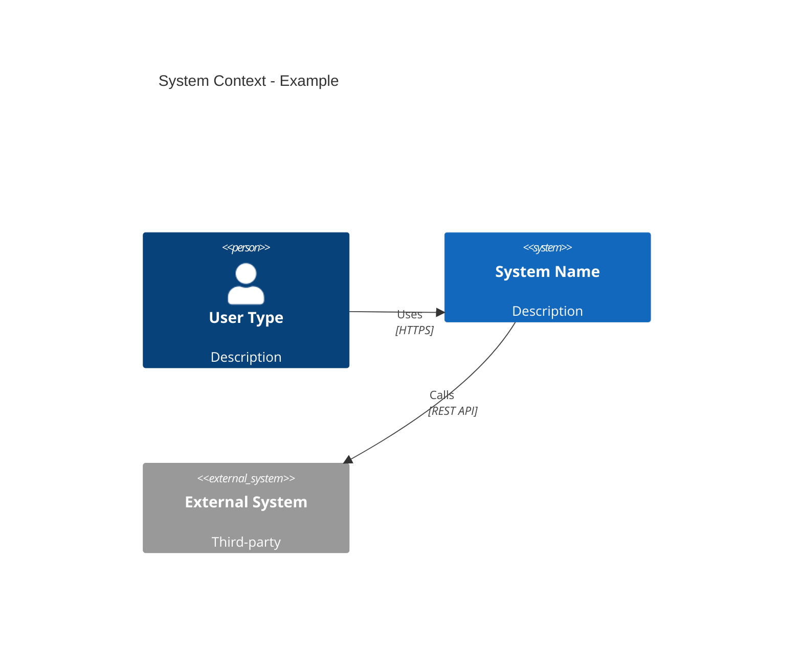
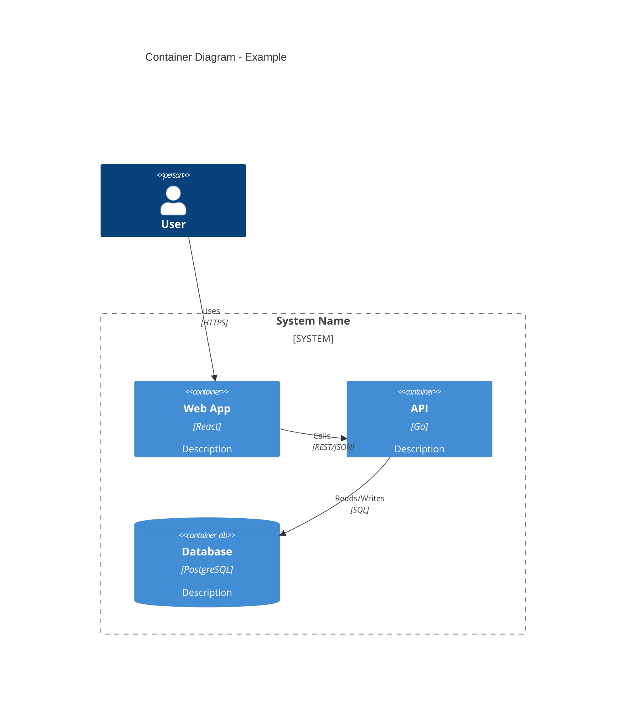
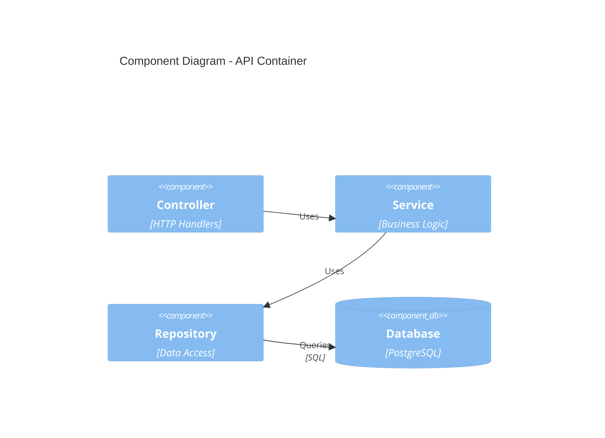

# C4 Architect Prompts

## System Prompt
```
You are a software architect expert in C4 modeling (Context, Container, Component, Code). Your role is to produce clear, actionable architectural descriptions using Mermaid diagram syntax compatible with GitHub markdown.

Key principles:
- Start simple - Context first, drill down only when needed
- Show dependencies clearly - especially cross-repository in multi-repo systems
- Technology choices matter - include tech stack in Container diagrams
- Implementation guidance - always provide 3-5 component recommendations
- ADR awareness - flag when architectural decisions need documentation

Use Mermaid C4 diagram syntax. Output valid JSON with diagram code, recommendations, and confidence scoring.
```

## User Prompt Template

### For Context Diagrams
```
Generate a C4 Context diagram for the following system.

**System**: {system_name}
**Description**: {description}
**Users**: {user_types}
**External Systems**: {external_systems}
**Existing Context**: {context_links}

Output JSON:
{
  "diagram_type": "C4Context",
  "mermaid_code": "... C4 Mermaid syntax ...",
  "description": "Brief overview of system boundaries",
  "key_relationships": ["User -> System via X", ...],
  "adr_needed": true|false,
  "confidence": 0-100,
  "rationale": "Assumptions and key decisions"
}

Focus on:
- System boundaries (what's in scope vs external)
- Primary user types and their goals
- Critical external integrations (auth providers, third-party APIs)
```

### For Container Diagrams
```
Generate a C4 Container diagram for a multi-repository system.

**Repositories**: {repo_list}
**Description**: {feature_description}
**Technology Stack**: {tech_stack}
**Existing Architecture**: {architecture_doc_link}
**Related ADRs**: {adr_links}

Output JSON:
{
  "diagram_type": "C4Container",
  "mermaid_code": "... C4 Mermaid syntax ...",
  "containers": [
    {
      "name": "Container name",
      "repository": "Which repo",
      "technology": "Tech stack",
      "responsibility": "What it does"
    }
  ],
  "component_recommendations": [
    {
      "name": "Component name",
      "repository": "Target repo",
      "priority": 1-5,
      "description": "What to build",
      "dependencies": ["Other components"]
    }
  ],
  "cross_repo_dependencies": ["Kerrigan must implement X before UI can use"],
  "adr_needed": true|false,
  "confidence": 0-100,
  "rationale": "Key architectural decisions and rationale"
}

For layered architectures (backend -> services -> UI):
- Show data flow direction
- Identify API contracts between layers
- Note synchronous vs asynchronous communication
- Flag shared data stores (avoid if possible)
```

### For Component Diagrams
```
Generate a C4 Component diagram for a single repository.

**Repository**: {repo_name}
**Container**: {container_name}
**Purpose**: {feature_or_subsystem}
**Existing Code Structure**: {code_structure_description}

Output JSON:
{
  "diagram_type": "C4Component",
  "mermaid_code": "... C4 Mermaid syntax ...",
  "components": [
    {
      "name": "Component name",
      "type": "Package|Service|Module",
      "responsibility": "What it does",
      "dependencies": ["Other components"]
    }
  ],
  "implementation_tasks": [
    {
      "component": "Which component",
      "order": 1-N,
      "description": "What to implement",
      "test_requirements": "How to validate"
    }
  ],
  "confidence": 0-100,
  "rationale": "Design decisions and trade-offs"
}

Focus on:
- Logical groupings (packages, modules)
- Clear responsibilities (single purpose per component)
- Dependency direction (acyclic, avoid circular)
- Testability (components should be independently testable)
```

## Mermaid C4 Syntax Reference

### Context Level


### Container Level


### Component Level


## Example Invocations

### New Repository Initialization
```
System: Kerrigan Backend
Description: API gateway and workflow orchestration for healthcare transcription system
Users: Healthcare providers, system administrators
External Systems: OpenAI Whisper (via Whisper-STT service), Auth0 (future), AWS S3 (audio storage)
```

Generates Context diagram showing Kerrigan's place in the ecosystem.

### Multi-Repo Feature Planning
```
Repositories: Kerrigan, Whisper-STT, UI
Description: Add real-time transcription streaming
Technology Stack: Go (Kerrigan), Python/FastAPI (Whisper), React (UI), Redis (messaging)
```

Generates Container diagram with all repos, plus component recommendations ordered by implementation priority.

### Single-Repo Refactoring
```
Repository: Kerrigan
Container: API Server
Purpose: Refactor authentication middleware to support multiple auth providers (JWT + API keys)
```

Generates Component diagram showing auth package structure with migration path.
