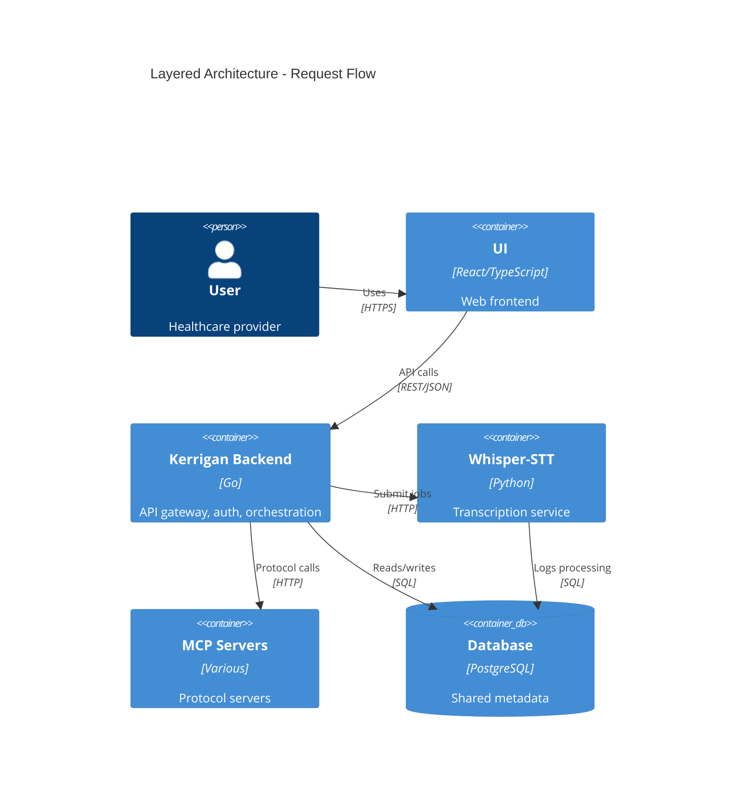

# 3. Layered Service Architecture with Backend as Orchestrator

Date: 2026-02-12

## Status

Accepted

## Context

The Coalescent-Emergence platform has three main application layers:
1. **Backend (Kerrigan)**: API gateway, authentication, workflow orchestration
2. **Services (Whisper-STT, MCP servers)**: Specialized processing (transcription, protocol handling)
3. **UI**: Web frontend for user interaction

We need to define the architectural relationships and dependency flow between these layers to guide development, API design, and cross-repository integration.

Key considerations:
- Solo developer initially, so simplicity is critical
- Future multi-developer teams will own different layers
- HIPAA compliance requires audit logging at the orchestration layer
- Services may need to scale independently (GPU for Whisper, stateless for MCP)

## Decision Drivers

* **Separation of concerns**: UI shouldn't know about ML implementation, services shouldn't handle auth
* **Scalability**: Services must scale independently from API gateway
* **Security**: Authentication/authorization centralized, not duplicated in each service
* **Compliance**: HIPAA audit trail must capture all data flow through backend
* **Simplicity**: MVP should avoid premature microservices complexity (no service mesh, no event bus yet)
* **Team ownership**: Backend team, platform team, UI team can work independently in future

## Considered Options

* **Layered (Backend → Services → UI)**: Backend orchestrates services, UI calls backend only
* **Peer-to-peer**: UI can call services directly, backend is just one of many services
* **Event-driven**: All components communicate via message queue (e.g., Kafka, RabbitMQ)

## Decision Outcome

Chosen option: "Layered architecture with Backend (Kerrigan) as orchestrator", because it provides clear dependency flow, centralized auth/audit, and simplest path for MVP while allowing future evolution.

**Dependency Flow**:
```
UI → Kerrigan (Backend) → Services (Whisper-STT, MCP-*)
```

- **UI** calls only Kerrigan API (no direct service calls)
- **Kerrigan** handles auth, orchestrates service calls, aggregates results
- **Services** are stateless workers, don't call each other or UI

### Consequences

* Good, because single point for authentication and HIPAA audit logging (Kerrigan)
* Good, because UI is simplified (one API to call, not multiple services)
* Good, because services can be replaced without changing UI (backend abstracts them)
* Good, because clear request flow for debugging (UI → Backend → Service, never skips layers)
* Bad, because backend can become a bottleneck (all requests flow through it)
* Bad, because adds latency for direct service calls (UI → Backend → Service vs UI → Service)
* Bad, because backend must implement proxying/orchestration logic for each service
* Neutral, because standard three-tier architecture (common pattern, well-understood trade-offs)

## Pros and Cons of the Options

### Layered Architecture (Chosen)

**Flow**: `UI → Backend → Services`

* Good, because auth and audit centralized in backend (single responsibility)
* Good, because UI has single API surface (Kerrigan), simplifying frontend code
* Good, because services can be internal-only (no public endpoints, simpler security)
* Good, because backend can implement retry logic, timeout handling, result aggregation
* Good, because future service changes isolated from UI (backend provides stable API)
* Bad, because backend must proxy all service calls (more backend endpoints)
* Bad, because latency: every service call goes through backend (extra network hop)
* Bad, because backend is single point of failure (if down, all services unreachable)

### Peer-to-Peer

**Flow**: `UI → Backend`, `UI → Services` (direct)

* Good, because lower latency for service calls (direct UI → Service, no backend hop)
* Good, because backend is not a bottleneck (traffic distributed)
* Good, because simpler backend (doesn't need to proxy services)
* Bad, because auth must be duplicated (every service needs JWT validation)
* Bad, because audit logging fragmented (UI logs, backend logs, service logs - hard to correlate)
* Bad, because UI must know about multiple APIs (service discovery, error handling for each)
* Bad, because HIPAA compliance harder (audit trail across multiple services)
* Bad, because exposes service implementation to UI (tight coupling)

### Event-Driven

**Flow**: All components publish/subscribe to message queue

```
UI → Queue ← Backend
         ↓
     Services
```

* Good, because fully decoupled (no direct service-to-service calls)
* Good, because asynchronous by default (better scalability under high load)
* Good, because easy to add new consumers (just subscribe to queue)
* Good, because built-in retry and failure handling (queue semantics)
* Bad, because significant complexity for MVP (requires message queue infrastructure)
* Bad, because harder to debug (trace request flow through queue)
* Bad, because eventual consistency model may confuse users ("where's my transcription?")
* Bad, because overkill for current scale (solo dev, hundreds of requests/day, not millions)

## Validation

Decision is correct if:

* ✅ UI developers can build features without understanding Whisper-STT or MCP internals (within 3 months)
* ✅ HIPAA audit logs in Kerrigan capture all data flows (transcription requests, results) for compliance (within 1 month)
* ✅ Backend proxying adds < 50ms p95 latency to service calls (within 3 months)
* ✅ Services can be replaced or upgraded without UI changes (within 6 months)
* ❌ If backend becomes latency bottleneck (>500ms p95 due to orchestration overhead), consider peer-to-peer or caching
* ❌ If event-driven patterns become necessary (async jobs, notifications), introduce message queue incrementally

### Migration Path to Event-Driven (if needed)

If asynchronous processing becomes critical:

1. Add message queue (Redis Streams or RabbitMQ) alongside HTTP
2. Implement async job pattern for long-running tasks (transcription)
3. Keep synchronous HTTP for real-time operations (auth, metadata queries)
4. Gradually migrate to event-driven where valuable (batch processing, notifications)

## Architecture Diagram



**Key Rules**:
1. UI MUST NOT call services directly
2. Services MUST NOT call UI or each other
3. Backend MUST log all service interactions for audit trail
4. Services MAY share database (read-only where possible)

## Links

* [Kerrigan Repository](https://github.com/Coalescent-Emergence/Kerrigan) - Backend implementation
* [UI Repository](https://github.com/Coalescent-Emergence/UI) - Frontend implementation
* [Whisper-STT Repository](https://github.com/Coalescent-Emergence/Whisper-STT) - ML service
* Related ADRs:
  - [ADR-0001: Multi-Repository Architecture](./0001-multi-repo-architecture.md)
  - See `Kerrigan/docs/decisions/` for backend API design ADRs
  - See `UI/docs/decisions/` for frontend architecture ADRs
* [Three-Tier Architecture](https://en.wikipedia.org/wiki/Multitier_architecture) - Reference pattern
